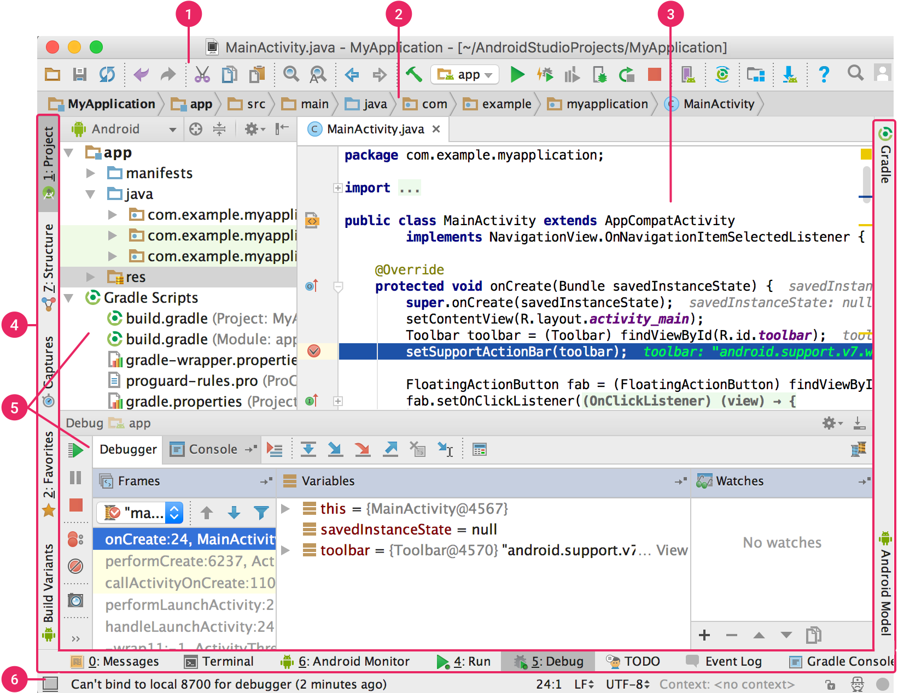
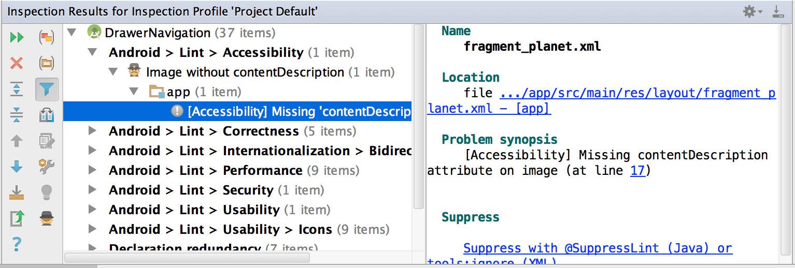

[TOC]


# 一、Android Studio

## 1.概览

### 项目结构

Android Studio的每个项目都包含一个或多个含源代码文件和资源文件的模块，Android项目视图按模块组织结构。模块类型包括：

* Android应用模块

* 库模块

* Google App Engine模块

所有编译文件都在顶层Gradle Scripts下显示，且每个应用模块都包含以下文件夹：

* manifests：包含AndroidManifest.xml文件

* java：包含 java源代码文件，包括 JUnit测试代码

* res：包含所有非代码资源，例如XML布局，界面字符串和位图图像

磁盘上的Android项目结构与此表示形式的项目结构不同，要查看项目实际的文件结构，选择project视图。


也可以自定义项目文件的视图，重点显示应用开发的特定方面。例如，选择项目的problems视图会显示指向包含任何已识别编码和语法错误。

### 界面



1. **工具栏**提供执行操作，包括运行应用和启动Android工具
2.  **导航栏**提供project窗口结构的精简视图
3. **编辑器窗口**创建和修改代码。因文件类型而变化，如查看布局文件，编辑器显示布局编辑器。
4. **工具窗口栏**在IDE窗口外部运行，并包含可用于展开或折叠各个工具窗口的按钮
5. **工具窗口**访问工具功能，包括项目管理、搜索和版本控制
6. **状态栏**显示项目和IDE本身的状态以及任何警告或消息

连按两下shift键或点击Android Studio窗口右上角的放大镜，从而搜索源代码、数据库、操作和界面元素。

#### 工具窗口

项目窗口、版本控制、运行、调试、logcat..

* 工具窗口的拖动、固定、关联、隐藏
* 默认工具窗口布局及自定义默认布局
* 无干扰模式Distraction Free Mode

#### 代码完成

* 基本完成：显示对变量、类型、方法和表达式等的基本建议，如果连续两次基本完成，系统显示更多结果，包括私有成员和非导入静态成员。
* 智能完成：根据上下文显示相关选项，智能完成可识别预期类型和数据流。如果连续两次调用智能完成，系统将显示更多结果。
* 语句完成：完成当前语句，添加缺失的圆括号、大括号/花括号和格式等。

Alt+Enter执行快速修复并显示建议的操作。

#### 查找示例代码

代码示例浏览器可以根据当前项目中突出显示的符合查找Google提供的优质android代码示例。

#### 导航


* 最近文件：可以在最近访问文件之间切换。```ctrl+e```
* 文件结构：可以查看当前文件的结构。```ctrl+f12```
* 转到类：可搜索并转到 ，支持复杂表达式，包括驼峰、路径、直线导航和中间名匹配。```ctrl+n```
* 转到文件：可转到文件或文件夹，转到文件夹在表达式末尾添加/。```ctrl+shift+n```
* 转到符号： 可按名称转到方法或字段。```ctrl+shift+alt+n```

#### 样式和格式

编辑时，android studio会自动应用代码设置中指定的格式和样式。可以自定义代码样式设置，包括指定制表符、缩进、空格、换行、花括号、空白行。**File>Settings>Editor>Code Style**

#### 版本控制基本知识

android studio 支持多个版本控制系统VCS，包括Git、CVS、Mercurial、Subversion、Google cloud source repositories。


**vcs>enable version>control integration**选择要与项目根目录相关联的版本控制选项。

**file>setting>version control**菜单选项设置和修改版本控制设置。

### Gradle编译系统

android studio将Gradle用作编译系统的基础，并通过android plugin for gradle提供更多面向android的功能。该编译系统可以作为集成工具从android studio菜单运行，也可以从命令行独立运行，编译系统功能：

* 自定义、配置和扩展编译流程。

* 使用相同的项目和模块为应用创建多个具有不同功能的APK

* 不同源集之间重复使用代码和资源

利用gradle灵活性，可以在不修改应用核心源文件的情况下完成以上操作。android studio 编译文件以build.gradle命名，使用android plugin for gradle提供的元素以groovy语法配置编译的纯文本文件，每个项目都有一个整个项目的顶级编译文件，以及用于各模块的单独模块级编译文件。在导入现有项目时，android studio会自动生成必要的编译文件。

#### 编译变体

编译系统可从一个项目创建多个同一应用不同版本，如付费版和免费版应用，或者在Google play 上为不同设备配置分发多个APK。

#### 多APK支持

 可以根据屏幕密度或 ABI 高效创建多个APK。例如可以针对 hdpi 和 mdpi 屏幕密度创建单独的应用APK，同时仍将他们视为一个变体，并允许它们共享测试APK，javac，dx和proguard设置。

#### 资源压缩

android studio 中的资源压缩功能可自动从封装应用和库依赖项中移除不使用的资源。资源压缩与代码压缩工具（如proguard）协同工作。

#### 管理依赖项

项目的依赖项在build.gradle文件中按名称指定。gradle可以自动查找依赖项，并在编译中提供这些依赖项。可以做build.gradle文件中声明模块依赖项、远程二进制依赖项以及本地二进制依赖项。android studio配置项目时默认使用Maven中央代码库配置包含在项目的顶级编译文件中。

### 调试和分析工具

#### 内联调试

使用内联调试功能在调试程序视图中对引用、表达式和变量值进行内联验证，提高代码走查效率，内联信息包括：

* 内联变量值
* 引用某选定对象的引用对象
* 方法返回值
* lambda和运算符表达式
* 工具提示值


启用内联调试**debug>setting>show value inline**


#### 性能分析器

android profiler跟踪应用内存和CPU使用情况，查找已解除内存分配的对象，查找内存泄露以及优化图形性能和分析网络请求。

#### 堆转储

android studio分析内存使用情况时可以同时启动垃圾回收，将java堆转储为android专有HPROF二进制格式文件中的堆快照，HPROF查看器会显示类、每个类的实例以及引用树，帮助跟踪内存使用情况及找出内存泄露

#### 内存分析器

使用内存分析器跟踪内存分配情况，

#### 数据文件访问

systrace和logcat等android SDK工具可以生成性能和调试数据，查看调试数据文件打开captures窗口，可将.hprof文件转换为标准调查RAM使用情况文件格式。

#### 代码检查

编译时android studio自动运行lint 及其他IDE检查，检查项目源文件是否存在潜在错误，以及正确性、安全性、性能、易用性、无障碍性和国际化方面是否需要优化改进。



除了lint检查，还可以执行intellij代码检查和注解验证，以简化编码工作流程。

#### android studio中的注解

android studio 支持为变量、参数和返回值添加注解，方便捕捉错误。

#### 日志消息

应用编译和运行时，logcat窗口查看adb输出和设备日志消息

#### 性能分析

分析应用的CPU、内存和网络性能，打开android profiler分析器 **view>tool windows>android profiler**

## 2.安装android studio

[下载](https://developer.android.google.cn/studio/)

更新 **help>check for update**

## 3.迁移至android studio

###  eclipse迁移至android studio

### intellij 迁移至android studio

## 4.配置IDE


## 5.键盘快捷键

## 6.无障碍功能

## 7.更新IDE和工具

# 二、工作流基础知识


1. 设置工作区
2. 编写应用
3. 编译并运行
4. 调试、分析和测试
5. 发布

# 三、管理项目

## 1.概览

### 模块

模块是源文件和编译设置的集合，可以让项目划分为独立的功能单位，项目可以包含一个或多个模块，一个模块可以将另一个模块作为依赖项。每个模块都可以单独编译、测试和调试。

添加新模块**file>new>new module**

#### android 应用模块

该模块为应用的源代码、资源文件和应用级设置（例如模块级编译文件和Android清单文件）提供容器。新建项目时默认模块名为“app”。


在**create new module**窗口中，android studio提供了以下类型应用模块：

* 手机和平板电脑模块
* wear os 模块
* android TV模块
* glass 模块

#### 动态功能模块

该模块表示应用中可利用Google play dynamic delivery的模块化功能。如可提供免安装体验。

#### 库模块

为可重用代码提供容器，可以将其作为依赖项用在其他应用模块中或将其导入其他项目中，从结构上讲，库模块与应用模块相同，但是编译时库模块会创建代码归档文件而不是APK，无法安装在设备上。android  studio提供以下库模块：

* android 库：可以包含android 项目中支持所有文件类型，包括源代码、资源和清单文件。编译结果是一个android ARchive文件AAR，可以添加为android应用模块的依赖项。
* java 库：只能包含 java源文件，编译结果是 java归档文件 JAR，可以添加为android应用模块或其他 java项目的依赖项。

#### Google cloud模块

该模块为Google cloud后端代码提供容器

### 项目文件

默认情况下，android studio 会在android视图中显示项目文件。此视图不能反映磁盘上的实际文件层次结构，而是按模块和文件类型进行整理，以简化项目的关键源文件之间的导航方式，并隐藏不常用的文件或目录。


* 在顶级gradle script组中显示相应项目的所有与编译相关的配置文件。
* 在模块级组中显示每个模块的所有清单文件
* 在一个组中显示所有备用资源文件
* minifests:包含androidmanifest文件
* java:包含java源文件，以软件包名分割各文件
* res:包含所有非代码资源，如XML布局，界面字符串和位图图像

#### Android项目视图

在project窗口选择project视图可以查看实际文件结构


项目名/模块名/build/包含编译输出

​						libs/包含专用库

​						src/包含相应模块在以下子目录中的所有代码和资源文件

​								androidtest/包含android设备上运行的插桩测试代码

​								main/包含主源集文件：所有的编译共享体的android代码和资源

​										androidmanifest.xml描述应用及各个组件的性质

​										java/包含java代码

​										jni/包含使用java本地接口 JNI 的本机代码

​										gen/包含android studio生成的java文件

​										res/包含应用资源，如可绘制对象文件，布局文件和界面字符串

​										assets/包含.apk文件

​								test/包含主机JVM上运行的本地测试代码

​					build.gradle(模块)定义了特定于模块的编译配置

​			build.gradle（项目）定义了所有模块的编译配置

### 项目结构设置

 

**file>project structure**

* SDK location：设置项目使用的 JDK 、android SDK和android NDK的位置
* project:设置gradle 和android  plugin for gradle的版本以及目录代码库位置名称
* developer serverces：包含来自google 或其他第三方android studio附加组件的设置
* modules：可以让你修改特定于模块的编译设置，包括目标和最低SDK、应用签名以及依赖项。

#### 模块

* properties：指定编译模块所用的SDK和编译工具的版本。
* signing：指定用于签署APK的证书
* dependencies：列出该模块的库、文件和模块依赖项

## 2.创建项目

**file>new >new project**

选择设备类型下的项目类别选项卡


配置项目设置


* name项目名称。My Application
* package name软件包名。com.example.myapplication，默认情况下软件包名为应用ID，之后可更改。
* save location项目本地保存位置
* 新建项目示例代码使用的语言
* 设置应用支持的最低API
* this project will support instant apps表示项目类型通过Google play支持免安装
* 默认使用androidx库，androidx库是android支持库的改进替换

导入现有项目**file>new>import project**

从版本控制导入项目**file>new>project from version control**


## 3.添加kotlin代码

[kotlincn中文站](https://www.kotlincn.net/)


## 4.Dynamic Delivery简介

### 概览

Google play的应用服务模型名为Dynamic Delivery，该模型使用android App bundle针对每位用户的设备配置生成并提供经过优化APK，因此用户只需下载其运行应用所需要的代码和资源。无需再编译、签署和管理多个APK，也可以获得更小、更优化的下载文件包。

### 配置基本模块

### 配置安装时分发

### 配置按需分发

### 按需分发最佳做法

### 配置免安装分发

### 配置按条件分发

## 5.添加C/C++代码

### 概览

### 安装NDK和CMake

### 配置CMake

### 关联Gradle

## 6.创建Android库

## 7.设置持续集成

# 四、编写应用

## 1.概览


## 2.从模板添加代码

## 3.查找示例代码

## 4.为新设备添加模块

## 5.创建 Java类或类型

## 6.使用 Java8语言功能

## 7.添加应用资源

## 8.使用Layout Editor构建界面

## 9.管理应用界面资源

## 10.设计应用主题背景

## 11.添加多密度矢量图形

## 12.使用Image Asset Studio 创建图标

## 13.创建可调整大小的位图（9-Patch）

## 14.创建WebP图片

## 15.本地化界面

## 16.添加Android应用连接

## 17.连接到Firebase

## 18.使用Lint检查改进代码

## 19.使用注解改进代码检查

## 20.工具属性参考

# 五、编译和运行应用

## 1.概览

## 2.在模拟器上运行应用

### 概览

### 创建和管理虚拟设备

### 从命令行启动虚拟设备

### 发送模拟器控制台命令

### 设置模拟器网络

### 配置硬件加速

### 对模拟器进行问题排查

## 3.在硬件设备上运行应用

### 概览

### 安装原始设备制造商（OEM）USB驱动程序

### 获取Google USB驱动程序

## 4.创建运行/调试配置

## 5.从命令行编译应用

# 六、配置编译版本

## 1.概览

## 2.设置应用ID

## 3. 添加编译依赖项

## 4.优化构建速度

## 5.使用构建缓存

## 6.配置编译变体

## 7.构建多个APK

## 8.合并多个清单

## 9.将构建变量注入清单

## 10.压缩应用

## 11.启用多DEX处理

## 12.使用APK分析器分析构建

## 13.Gradle提示与诀窍

# 七、调试应用

## 1.概览

## 2.配置开发者选项

## 3.写入和查看日志

## 4.分析堆栈轨迹

## 5.使用布局检查器调试布局

## 6.使用精美像素风格验证设计

## 7.查看设备上的文件

## 8.截取屏幕截图

## 9.录制视频

## 10.获取并阅读错误报告

# 八、测试应用

## 1.概览

## 2.从命令行进行测试

## 3.使用Espresso测试记录器创建界面测试

## 4.UI/App Exerciser Monkey

## 5.monkeyrunner 参考

### 概览

### monkeydevice

### monkeyimage

### monkeyrunner

# 九、剖析应用性能

## 1.概览

## 2.衡量应用效果

## 3.应用设置基准

### 概览

### 在不使用Gradle的情况下编译基准

### 在持续集成中运行基准

## 4.分析和调试预编译APK

## 5.检查CPU活动

### 概览

### 通过检查应用生成跟踪日志

## 6.查看堆和内存分配 

## 7.检查网络活动

## 8.检查能耗情况

#  十、发布应用

## 1.概览

## 2.准备发布

## 3.应用版本控制

## 4.应用签名

## 5.上传应用

# 十一、命令行工具

## 1.概览

## 2.aapt2

## 3.adb

## 4.apkanalyzer

## 5.apksigner

## 6.avdmanger

## 7.bmgr

## 8.bundletool

## 9.d8

## 10.dmtracedump

## 11.dumpsys

## 12.etc1tool

## 13.jobb

## 14.jetifier-standalone

## 15.logcat

## 16.mksdcard

## 17.sdkmanager

## 18.systrace

## 19.perfetto

## 20.zipalign

## 21.环境变量