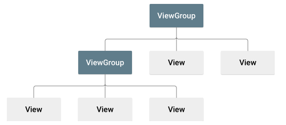

# 布局layout

界面为应用组件之间的相互位置关系。

界面中的元素包括View和ViewGroup对象。

View对象（微件）为用户可见并具有相关功能的组件，如：按键、文本

viewGroup对象（布局）是组织组件之间关系的不可见容器，如线性布局，约束布局。



可以使用XML声明界面元素（包括编写XML代码或使用图形化工具Layout Editor）,或者使用java代码创建微件或布局并控制其元素属性。也可以使用XML创建默认布局，在java代码在运行控制布局。

与XML代码相似，标签元素使用<元素>开始标记，使用<元素/>结束标记，每个布局文件都必须只包含一个根元素，一般为指明所使用的根布局。宽度和高度都是布局和微件必须的属性。

错误：一个XML文件内只能有一个根元素

```
<LinearLayout android:layout_width="match_parent"
              android:layout_height="match_parent"
  <Button   android:layout_width="wrap_content"
            android:layout_height="wrap_content"
</LinearLayout>
<LinearLayout
  <Button   android:layout_width="wrap_content"
            android:layout_height="wrap_content"
</LinearLayout>
```

其他元素（布局和微件）都要在此标签之内声明。从而形成类似m叉树形式的view层次结构，称为结构树。根元素也可以是布局或微件或merge元素。

```xml
<LinearLayout xmlns:android="http://schemas.android.com/apk/res/android"
              android:layout_width="match_parent"
              android:layout_height="match_parent"
              android:orientation="vertical" >
    <TextView android:id="@+id/text"
              android:layout_width="wrap_content"
              android:layout_height="wrap_content"
              android:text="Hello, I am a TextView" />
    <Button android:id="@+id/button"
            android:layout_width="wrap_content"
            android:layout_height="wrap_content"
            android:text="Hello, I am a Button" />
</LinearLayout>
```


# 布局ViewGroup

布局为微件的容器

布局的属性：

**android: id**	资源ID。元素的唯一资源名称，findViewById方法通过id可以获得布局的引用。ID 无需整个结构树中具有唯一性，但其在您要搜索的结构树部分中应具有唯一性（要搜索的部分往往是整个结构树，因此最好尽可能具有全局唯一性）。

**android：layout_height**	布局的高度，值可以为match_parent 或 wrap_content，wrap_content 指将其大小调整为内容所需的尺寸。match_parent 尽可能采用其布局所允许的最大尺寸。

**android: layout_width** 	布局的宽度

## LinearLayout

一种使用单个水平行或垂直行来组织子项的布局。此布局会在窗口长度超出屏幕长度时创建滚动条。

## RelativeLayout

指定子对象彼此之间的相对位置（子对象 A 在子对象 B 左侧）或子对象与父对象的相对位置（与父对象顶部对齐）。

## FrameLayout

# 微件View